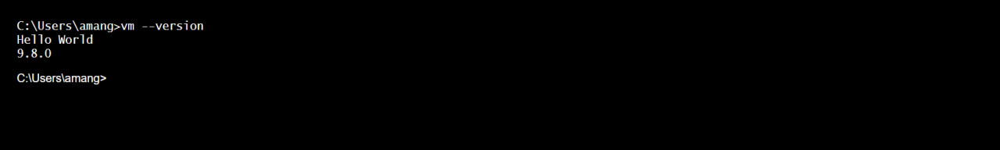
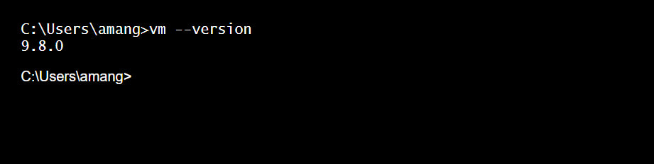

# Reinforcement-Learning-Open-Source-Fest-Screening-Task-2023
## Feature Engineering in VW using LUA
The following repository contains the files generated on completing the screening tasks for the project <b>Feature Engineering in Vowpal Wabbit using Lua</b>.<br>
## System details
- System: DELL
- OS: Windows 11
- Architecture: X64
- Lua version: lua-5.4.4

## Exercise 1: Working with VW
### Tasks
1. Compile and run VW <br><br>Output (1):<br><br>

2. Add some code to print “Hello world” when VW starts<br><br>
Output (1):<br><br><br><br>


3. Commit this to your own fork of the repo<br>
https://github.com/AmanGuptaCoder/vowpal_wabbit <br>

### Instructions to build and run 
1. Clone my fork of vowpal wabbit <br>`git clone https://github.com/AmanGuptaCoder/vowpal_wabbit`<br>
2. Follow the build and install instructions at <br> https://github.com/VowpalWabbit/vowpal_wabbit/wiki/Building<br>
3. Add the build location to the `PATH`<br
4. Run any vw command to see the output<br> `vw --version` <br>

## Exercise 2: Working with Lua
### Tasks
1. Build Lua<br><br>Output (1):<br><br>

2. Create Lua object in C++. Print “[your name] says hello” from within Lua. Here's the file created: [createLuaObject.cpp](https://github.com/rum1887/RLOSF23-Screening-Exercise/blob/main/createLuaObject.cpp)<br><br>Output (1):<br><br>

3. Pass an int variable to Lua and print out the value in Lua. Here's the file created: [passingDataToLua.cpp](https://github.com/rum1887/RLOSF23-Screening-Exercise/blob/main/passingDataToLua.cpp)<br><br>Output (1):<br><br>

4. Change value of an int variable in Lua and print it out in C++. Here's the file created: [changeDataLua.cpp](https://github.com/rum1887/RLOSF23-Screening-Exercise/blob/main/changeDataLua.cpp)<br><br>Output (1):<br><br>

### Instructions to build and run<br>
1. Clone the repository <br> ```git clone https://github.com/AmanGuptaCoder/Reinforcement-Learning-Open-Source-Fest-Screening-Task-2023```
2. Complile each file using gcc compliler on the command line by passing the file name and the following flags as arguments: <br>
- -I flag includes path to the directory of the source code and the header files 
- -L flag helps the linker find thedirectory which contains "liblua.a" file.
- -llua
- -lstdc++ <br>


## References
[Programming In Lua - Lua Quick Start Guide [Book]](https://www.oreilly.com/library/view/lua-quick-start/9781789343229/e839a89f-d773-4f06-aa24-171fee62aa3f.xhtml#:~:text=The%20first%20edition%20of%20Programming,and%20nearly%20200%20top%20publishers.)
<hr><br>